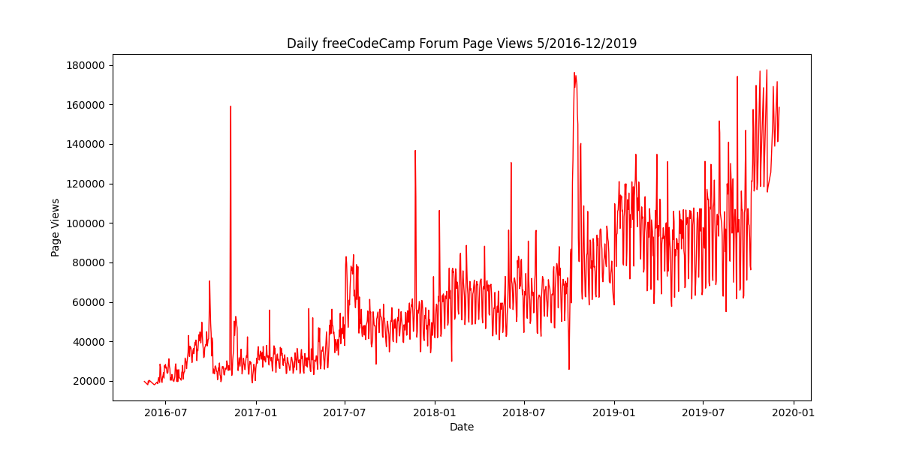
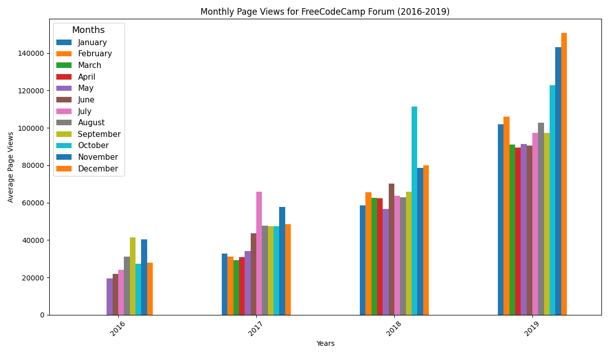
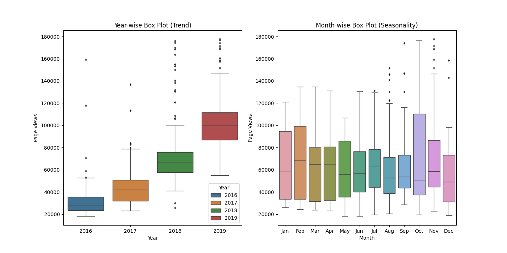

# Time Series Data Visualization Project

This project is part of the **freeCodeCamp Data Analysis Certification**. It's all about visualizing time series data using Python libraries like Pandas, Matplotlib, and Seaborn. The dataset contains 1304 rows of daily page views from the freeCodeCamp forum, spanning from May 9, 2016, to December 3, 2019. The goal is to create a variety of visualizations (line plot, bar plot, and box plot) to explore patterns in the data and understand the growth of the forum over time.

## What I Did in This Project

1. **Imported the Data**: Loaded the dataset with daily page views from the freeCodeCamp forum.
2. **Cleaned the Data**: Filtered out any days where the page views were in the top or bottom 2.5% of the dataset to get rid of outliers.
3. **Created Visualizations**:
   - **Line Plot**: Displayed daily page views over the period from May 2016 to December 2019.
   - **Bar Plot**: Showed average daily page views for each month, grouped by year.
   - **Box Plot**: Visualized the distribution of page views both year-wise and month-wise.

## Dataset

The dataset used for this project contains **1304 rows** with daily page views for the freeCodeCamp forum given in fcc-forum-pageviews.csv, which include the following columns:

- **date**: The date of the page view.
- **value**: The number of page views on that specific date.

## Requirements

To get started, you'll need to install a few libraries:

- `pandas`
- `matplotlib`
- `seaborn`

You can easily install them using `pip`:

```bash
pip install pandas matplotlib seaborn
```

## Output

- **line_plot.png**: A line plot showing daily page views.
- **bar_plot.png**: A bar plot showing monthly average page views.
- **box_plot.png**: A box plot showing year-wise and month-wise distributions.

## Observations & Inferences
### 1. 📉 Line Plot Analysis



- There is a **clear upward trend**, with notable increases during certain months each year.
- Peaks and dips occur seasonally, but the **overall trajectory is rising**.

### 2. 📊 Bar Plot Analysis



- The **bar plot** compares monthly views across different years.
- This visualization highlights a **stark contrast** when comparing identical months across different years.
 

## 3. 📦 Box Plot Analysis



- The **box plots** summarizes viewership by year and by months.
- The **median** and **interquartile range (IQR)** shift **upwards** year over year.
- The data becomes more **concentrated around higher values**, indicating both growth and stability.


📈 **freeCodeCamp is steadily gaining viewership over time.**


